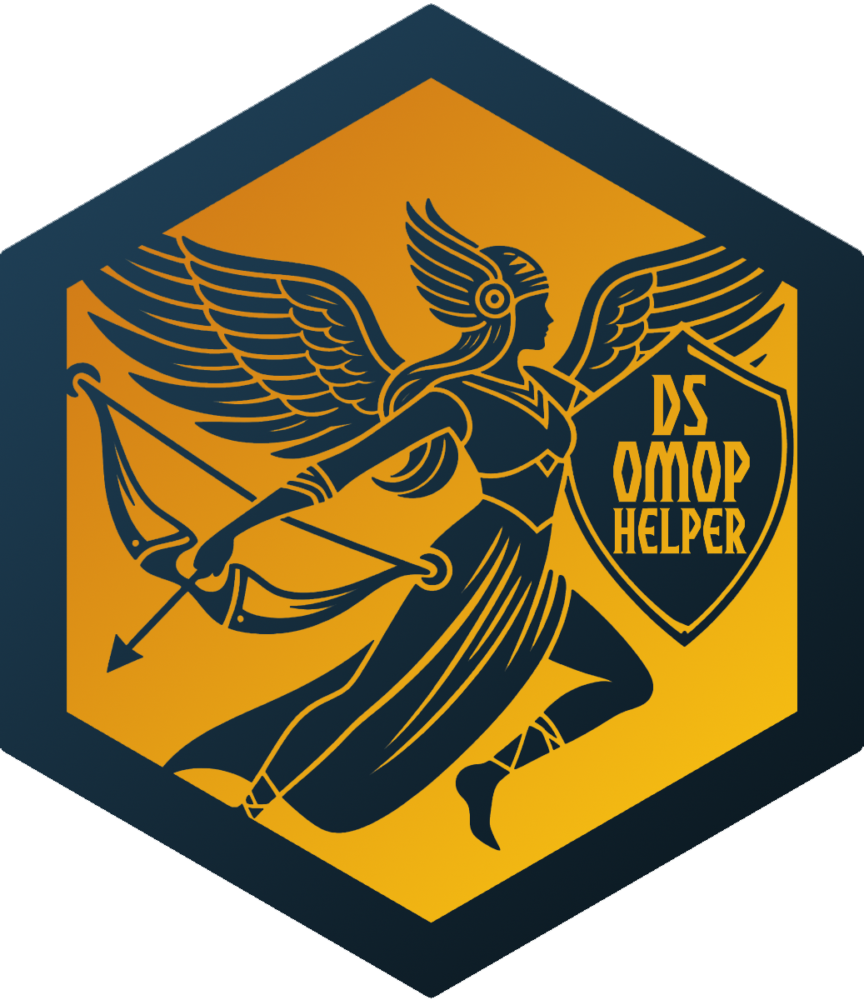

# dsOMOPClient

## Introduction


The `dsOMOP` package is designed to facilitate the interaction with remote databases formatted in the [Observational Medical Outcomes Partnership (OMOP) Common Data Model (CDM)](https://www.ohdsi.org/data-standardization/) from within a [DataSHIELD](https://www.datashield.org/about/about-datashield-collated) environment. It provides a suite of functions that allow users to fetch and transform data from these databases into a format that is intelligible and usable within the DataSHIELD analytical workflow. This integration ensures that data analysis complies with the DataSHIELD security model, which is crucial for maintaining the privacy and security of the data.

Key features of the `dsOMOP` package include:

- **Data retrieval and transformation:** Functions to fetch data from OMOP CDM databases and transform it into a user-friendly table format.
- **Compliance with DataSHIELD security model:** Ensures that all data manipulations and analyses are performed in a way that adheres to the disclosure control measures set by DataSHIELD.
- **Support for database interaction:** Includes methods for checking database content (such as table, column and concept catalogs) and data filtering based on user-defined criteria. This enables researchers to tailor their data queries to specific research needs.

## Structure

The `dsOMOP` ecosystem comprises two essential components designed to work in tandem: the server-side package (`dsOMOP`) and the client-side package (`dsOMOPClient`). Each component plays a pivotal role in the integration of OMOP CDM databases within the DataSHIELD environment. For comprehensive details on installation, setup, and usage, please refer to the respective repositories:

- **Server-Side package `dsOMOP`**: This component is installed on the DataSHIELD server and is responsible for direct interactions with the OMOP CDM databases. It retrieves, transforms, and returns data in a format compatible with DataSHIELD's analytical tools. For code, installation instructions, and more, visit [https://github.com/isglobal-brge/dsOMOP](https://github.com/isglobal-brge/dsOMOP).

- **Client-Side package `dsOMOPClient`**: Utilized by researchers and data analysts, this package facilitates the communication with the `dsOMOP` package on the server. It sends data requests and receives processed data for analysis, ensuring a user-friendly experience for specifying data needs and analysis parameters. For code, installation instructions, and more, visit [https://github.com/isglobal-brge/dsOMOPClient](https://github.com/isglobal-brge/dsOMOPClient).

## Installation

To install the client-side package `dsOMOPClient`, follow the steps below. This guide assumes you have R installed on your system and the necessary permissions to install R packages.

The `dsOMOPClient` package can be installed directly from GitHub using the `devtools` package. If you do not have `devtools` installed, you can install it using the following command in R:
```R
install.packages("devtools")
```

You can then install the `dsOMOPClient` package using the following command in R:
```R
devtools::install_github('isglobal-brge/dsOMOPClient')
```

Once the package is installed, you can load it into your R environment using the following command:
```R
library(dsOMOPClient)
```

## Community development and extensions

The `dsOMOPClient` package serves as a gateway for interacting with databases in the OMOP CDM format, enabling the fetching of tables to be integrated into the DataSHIELD workflow. This integration adheres to the privacy standards and disclosure control mechanisms inherent to the DataSHIELD software, ensuring that the subsequent data manipulation and analysis operations are secure.

While `dsOMOPClient` acts as an interface, the potential for automation or streamlining of processes through the creation of supplementary functions, scripts, and packages is vast. We strongly encourage the community to develop tools that build upon `dsOMOPClient`, tailoring them to specific use cases and research needs. Such community-driven development not only enhances the utility of `dsOMOPClient` but also fosters a collaborative ecosystem around the combined use of both DataSHIELD and OMOP CDM.

<a href="https://github.com/isglobal-brge/dsOMOPHelper"></a>

An example of this approach is **[`dsOMOPHelper`](https://github.com/isglobal-brge/dsOMOPHelper)**, a complementary package we have developed alongside `dsOMOPClient`. `dsOMOPHelper` illustrates how the process can be simplified by combining commands from `dsOMOPClient` and `dsBaseClient` (which invokes standard DataSHIELD workflow operations). This package significantly reduces the complexity of using `dsOMOPClient` for most simple use cases, where data from an OMOP CDM database may be used for epidemiological studies within the DataSHIELD environment. You can read more about `dsOMOPHelper` and its functionalities by visiting its GitHub repository: [https://github.com/isglobal-brge/dsOMOPHelper](https://github.com/isglobal-brge/dsOMOPHelper).

## Acknowledgements

- The development of dsOMOP has been supported by the **[RadGen4COPD](https://github.com/isglobal-brge/RadGen4COPD)**, **[P4COPD](https://www.clinicbarcelona.org/en/projects-and-clinical-assays/detail/p4copd-prediction-prevention-personalized-and-precision-management-of-copd-in-young-adults)**, and **[DATOS-CAT](https://datos-cat.github.io/LandingPage)** projects. These collaborations have not only provided essential financial backing but have also affirmed the project's relevance and application in significant research endeavors.
- This project has received funding from the **[Spanish Ministry of Science and Innovation](https://www.ciencia.gob.es/en/)** and **[State Research Agency](https://www.aei.gob.es/en)** through the **“Centro de Excelencia Severo Ochoa 2019-2023” Program [CEX2018-000806-S]** and **[State Research Agency](https://www.aei.gob.es/en)** and **[Fondo Europeo de Desarrollo Regional, UE](https://ec.europa.eu/regional_policy/funding/erdf_en) (PID2021-122855OB-I00)**, and support from the **[Generalitat de Catalunya](https://web.gencat.cat/en/inici/index.html)** through the **CERCA Program** and **[Ministry of Research and Universities](https://recercaiuniversitats.gencat.cat/en/inici/) (2021 SGR 01563)**.
- This project has received funding from the **"Complementary Plan for Biotechnology Applied to Health"**, coordinated by the **[Institut de Bioenginyeria de Catalunya (IBEC)](https://ibecbarcelona.eu/)** within the framework of the **Recovery, Transformation, and Resilience Plan (C17.I1)** - Funded by the **[European Union](https://european-union.europa.eu/index_en)** - **[NextGenerationEU](https://next-generation-eu.europa.eu/index_en)**.
- Special thanks to **[Xavier Escribà-Montagut](https://github.com/ESCRI11)** for his invaluable support in the development process.

## Contact

For further information or inquiries, please contact:

- **Juan R González**: juanr.gonzalez@isglobal.org
- **David Sarrat González**: david.sarrat@isglobal.org

For more details about **DataSHIELD**, visit [https://www.datashield.org](https://www.datashield.org).

For more information about the **Barcelona Institute for Global Health (ISGlobal)**, visit [https://www.isglobal.org](https://www.isglobal.org).
